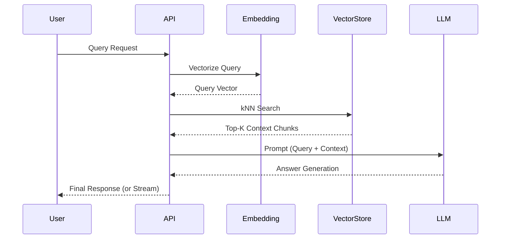

# RAG Pipeline Flow and Latency

## Overview
The Retrieval-Augmented Generation (RAG) pipeline enables precise, context-aware answers to user queries by fetching relevant documents from a vector store before passing the context to the Large Language Model (LLM).

## Architecture Flow

1. **User Query Submission**: 
   - A query is submitted via `POST /api/search/query` or streamed via `GET /api/search/stream`.
2. **Query Embedding**: 
   - The query text is vectorized using an Embedding Model (e.g., `text-embedding-ada-002` or open-source equivalents via the embedding service).
   - *Latency component*: ~50-150ms depending on the embedding model backend.
3. **Vector Store Retrieval**: 
   - A k-Nearest Neighbors (kNN) search runs against Elasticsearch (`dense_vector` mapping). 
   - *Latency component*: ~20-50ms (optimized for sub-second retrieval).
4. **Context Construction & Prompting**:
   - The top K chunks (e.g., top 5) are assembled into a structured prompt.
5. **LLM Generation**:
   - The LLM processes the constructed prompt and generates an answer.
   - *Latency component*: ~500ms - 2500ms (depending on LLM size, complexity, and generation length). For streaming, TTFB (Time to First Token) is usually ~200-500ms.

## Performance & Optimization
- **Batch Embedding Service**: When ingesting data, chunks are batched into requests of 100+ documents, vastly improving indexing throughput.
- **kNN Caching**: Frequent queries hit Elasticsearch's query cache, dropping retrieval latency to <10ms.
- **Streaming Support**: `search/stream` uses Server-Sent Events (SSE) to display the LLM response progressively, providing a perceived instantaneous response time for users.

## Diagram

